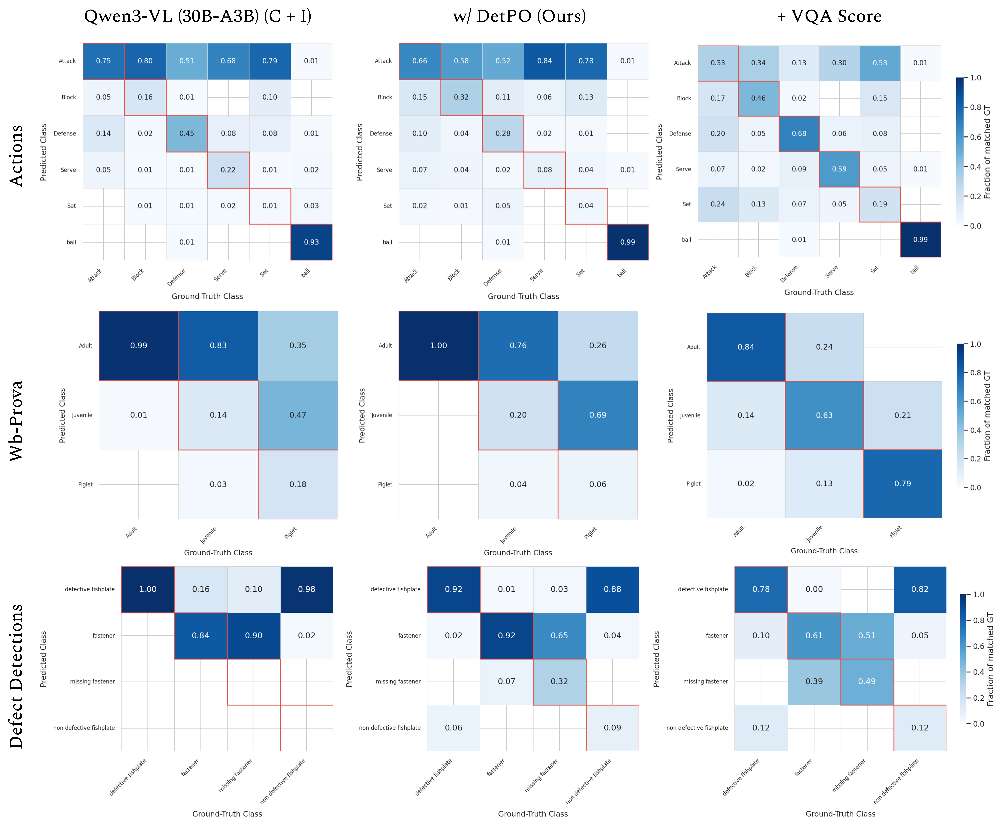

# DetPO: In-Context Learning with Multi-Modal LLMs for Few-Shot Object Detection

[](https://arxiv.org/abs/2603.23455)
[](https://github.com/ggare-cmu/DetPO)
[](https://ggare-cmu.github.io/DetPO/)

A gradient-free, black-box prompt optimization framework for few-shot object detection with frozen Multi-Modal LLMs. DetPO iteratively refines text-only class descriptions using contrastive error examples (false positives and false negatives) from a few-shot training set, then calibrates confidence with a VQA-based scoring step. Inference is served through a **vLLM OpenAI-compatible HTTP server**, decoupling model hosting from the evaluation pipeline.

---

## Key Results

DetPO outperforms prior black-box prompt optimization methods (GEPA, MIPROv2) by up to **9.7% mAP** on the Roboflow20-VL benchmark.

### Roboflow20-VL (mAP, 20 diverse domains)

| Method | Aerial | Document | Flora & Fauna | Industrial | Medical | Sports | Other | **All** |
|---|---|---|---|---|---|---|---|---|
| GroundingDINO | 28.5 | 5.1 | 33.7 | 12.8 | 0.4 | 5.1 | 16.9 | 16.8 |
| LLMDet | 32.3 | 4.4 | 33.6 | 12.6 | 0.7 | 6.7 | 16.7 | 17.2 |
| Qwen3-VL 30B (baseline) | 9.0 | 7.8 | 23.5 | 9.6 | 0.7 | 14.4 | 10.1 | 11.9 |
| + GEPA | 9.3 | 12.4 | 23.6 | 10.8 | 1.3 | 15.1 | 11.3 | 13.0 |
| + MIPROv2 | 8.7 | 5.6 | 18.6 | 10.3 | 0.0 | 15.1 | 9.9 | 10.7 |
| **+ DetPO + VQA Score (Ours)** | **16.1** | **25.2** | **36.5** | **20.1** | 0.2 | **25.7** | **18.4** | **21.6** |
| Gemini 3 Pro (baseline) | 27.0 | 26.7 | 31.3 | 26.2 | 2.6 | 26.9 | 13.3 | 23.8 |
| + GEPA | 19.2 | 30.6 | 32.1 | 32.7 | 2.0 | 28.2 | 20.8 | 25.6 |
| **+ DetPO + VQA Score (Ours)** | 26.2 | **35.7** | 35.4 | 23.3 | **3.9** | 28.2 | 20.4 | **26.3** |

### DetPO Transfers Across Models

| Model | Baseline | + DetPO | + DetPO + VQA Score |
|---|---|---|---|
| Qwen2.5-VL 7B | 6.2 | 9.1 | **11.9** |
| Qwen2.5-VL 72B | 10.4 | 15.7 | **16.5** |
| Qwen3-VL 8B | 11.4 | 15.3 | **17.5** |
| Qwen3-VL 30B-A3B | 11.9 | 19.4 | **21.6** |

### Why Multi-Modal ICL Hurts Detection

Naively adding few-shot visual examples to the prompt consistently *hurts* accuracy across all tested models — DetPO avoids this by optimizing text-only prompts instead.

| Model | Class Names only | + Instructions | + Images |
|---|---|---|---|
| Qwen2.5-VL 7B | 4.6 | 6.2 | 1.8 |
| Qwen2.5-VL 72B | 7.1 | 10.4 | 10.1 |
| Qwen3-VL 8B | 10.4 | 11.4 | 7.0 |
| Qwen3-VL 30B-A3B | 10.7 | 11.9 | 9.8 |
| Gemini 3 Pro | 21.9 | 23.0 | 23.9 |

---

## Figures

| | |
|---|---|
|  |  |
| **DetPO Overview.** Generates initial class descriptions from GT boxes, then iteratively refines them using contrastive false-positive and false-negative examples. | **Contrastive Refinement.** Highlighted text shows newly added details that distinguish *Serve* from *Attack* in a volleyball dataset. |
|  |  |
| **Qualitative Results.** Baseline suffers from dense false positives; DetPO + VQA Score recovers missed objects and suppresses erroneous detections. | **Confusion Matrix.** DetPO resolves class imbalances and improves true positive rates for rare/nuanced classes. |

---

This repository contains scripts to set up the environment and run DetPO-based prompt optimization for object detection.

## Setup

Follow the steps below **in order** to prepare the environment.

### 1. Install the Conda Environment

Create and set up the Conda environment using the provided setup script. The setup script needs ROBOFLOW_API_KEY to download RF20-datasets:

```bash
bash setup.sh ROBOFLOW_API_KEY
```

After the script completes, activate the environment:

```bash
conda activate detpo-env
```

## Usage

All scripts require a running vLLM server. Start it before running any evaluation or optimization script.

### 0. Launch the vLLM Server

Qwen models are gated on Hugging Face and require authentication before vLLM can download them. Log in once before starting the server:

```bash
huggingface-cli login
# or set the environment variable directly:
export HF_TOKEN=your_token_here
```

Then start the server:

```bash
bash detpo/launch_vllm_server.sh
# override model or port:
bash detpo/launch_vllm_server.sh --model Qwen3-VL-8B-Instruct --port 8001
```

The server exposes an OpenAI-compatible API at `http://localhost:8000/v1` by default. All scripts accept `--server_url` to point at a different host/port.

Once the server prints `Application startup complete`, proceed with the steps below.

### Detection Prompt Optimization (DetPO)

Automatically refine class descriptions over N iterations, then run final evaluation:

```bash
python -m detpo.run_detpo_optimization \
    --model_name Qwen3-VL-30B-A3B-Instruct \
    --root_path ./datasets/rf100-vl-fsod/ \
    --dataset_path my-dataset \
    --output_dir results/ipt_output \
    --ipt_mode \
    --num_ipt_iterations 10 
```

### Zero-Shot Evaluation

Evaluate a dataset on the test split using existing class instructions:

```bash
python -m detpo.run_evaluation \
    --model_name Qwen3-VL-8B-Instruct \
    --root_path ./datasets/rf100-vl-fsod/ \
    --dataset_path my-dataset \
    --data_instr_path ./data_instr/default/README.dataset \
    --output_dir results/eval_output 
```

### VQA Rescoring (standalone)

Re-score detections from a prior inference run without re-running detection. Reads pre-computed rank-scored predictions from `<output_dir>/live_results/rank/`.

```bash
python -m detpo.run_vqa_rescore \
    --model_name Qwen3-VL-30B-A3B-Instruct \
    --root_path ./datasets/rf100-vl-fsod/ \
    --dataset_path my-dataset \
    --output_dir results/eval_output \
    --data_instr_type ipt \
    --vqa_rescore
```


### Optional Arguments

| Argument | Scripts | Description | Default |
|---|---|---|---|
| `--model_name` | all | Qwen model variant served by the vLLM server | `Qwen3-VL-235B-A22B-Instruct` |
| `--server_url` | all | Base URL of the vLLM OpenAI-compatible server | `http://localhost:8000/v1` |
| `--root_path` | all | Root directory containing dataset subdirectories | `./datasets/rf100-vl-fsod/` |
| `--dataset_path` | all | Name of the specific dataset subdirectory | required |
| `--output_dir` | all | Directory for saving results, predictions, and visuals | required |
| `--seed` | all | Random seed for reproducibility | `42` |
| `--vqa_batch_size` | all | Batch size for VQA rescoring calls | `8` |
| `--data_instr_path` | `run_evaluation` | Path prefix for class instruction JSON files | `./data_instr/default/README.dataset` |
| `--rank_rescore` | `run_evaluation`, `run_detpo_optimization` | Assign scores by detection rank order | off |
| `--siglip_rescore` | `run_evaluation`, `run_detpo_optimization` | Re-score detections using SigLIP zero-shot classification | off |
| `--ipt_mode` | `run_detpo_optimization` | Enable iterative prompt refinement | off |
| `--num_ipt_iterations` | `run_detpo_optimization` | Number of IPT refinement iterations per class | `3` |
| `--num_samples` | `run_detpo_optimization` | Max annotations per class for train/val subsampling during IPT | `None` (use all) |
| `--vqa_rescore` | `run_vqa_rescore` | Re-score detections using a VQA yes/no prompt | off |
| `--vqa_nocontext` | `run_vqa_rescore` | VQA rescoring without class instruction context | off |
| `--siglip_rescore` | `run_vqa_rescore` | Re-score detections using SigLIP zero-shot classification | off |
| `--data_instr_type` | `run_vqa_rescore` | `ipt` for refined instructions, `default` for README defaults | `ipt` |

## Pre-computed Prompts

The `prompts/` directory contains ready-to-use class descriptions for the Roboflow20-VL benchmark datasets:

```
prompts/
├── default/                        # Baseline descriptions parsed from dataset README files
│   ├── README.dataset_actions.json
│   └── ...                         # One file per dataset
└── detpo/                          # DetPO-optimized descriptions (per model)
    ├── Qwen2.5-VL-7B-Instruct/
    ├── Qwen2.5-VL-72B-Instruct/
    ├── Qwen3-VL-8B-Instruct/
    └── Qwen3-VL-30B-A3B-Instruct/
        ├── all_refined_class_instructions_actions.json
        └── ...                     # One file per dataset
```

To run evaluation with pre-computed DetPO prompts, point `--data_instr_path` (for `run_evaluation`) or place the files where `run_vqa_rescore` expects them under `<output_dir>/iterative_prompt_refinement/`.

---

## Dataset Requirements

The script expects a dataset structure similar to **Roboflow COCO exports**. The directory at `--dataset` must contain:

1. **`README.dataset.txt`**: Used to parse class metadata and instructions.
2. **`train/` directory**: Contains images and `_annotations.coco.json`.
3. **`valid/` directory**: Contains images and `_annotations.coco.json`.
3. **`test/`  directory**: Contains images and `_annotations.coco.json`.

**Example Structure:**

```text
/my-dataset
  ├── README.dataset.txt
  ├── train/
  │   ├── _annotations.coco.json
  │   └── image1.jpg ...
  └── valid/
      ├── _annotations.coco.json
      └── image2.jpg ...
  └── test/
      ├── _annotations.coco.json
      └── image3.jpg ...

```


## How IPT Works

For each class in the dataset, IPT runs the following loop:

```
1. Generate initial class definition
     └── Uses all GT training examples (green boxes) + negative examples
         from other classes (red boxes) to produce a rich textual definition

2. For N iterations:
     a. Run inference on the training split using the current definition
     b. Evaluate with COCO metrics (mAP, AR)
     c. Identify the worst false positive (highest-confidence wrong detection)
        and worst false negative (most-missed GT object)
     d. Show the VLM a correct example alongside the error case and ask it
        to refine the class definition to fix that error type
     e. Only accept the new definition if mAP does not decrease

3. Evaluate all candidate definitions on the validation split
     └── Selects the best-performing definition as the final output

4. Save all refined definitions to:
     <output_dir>/iterative_prompt_refinement/all_refined_class_instructions_<dataset>.json
```

After IPT, the evaluator automatically runs a final test-split evaluation using the refined definitions.

---

## Output Structure

```
<output_dir>/
├── predictions/                          # Cached COCO-format prediction JSON files
├── evaluations/                          # COCO eval stats per iteration and eval type
├── visuals/                              # Visualizations of GT vs predicted boxes
├── live_results/                         # Per-image inference results (JSONL + JSON)
├── iterative_prompt_refinement/
│   ├── <dataset>/
│   │   ├── <class>_original_definition.txt
│   │   ├── <class>_initial_definition.txt
│   │   ├── <class>_best_instructions_<dataset>_cls_<class>.txt
│   │   ├── <class>_refined_instructions_<dataset>_cls_<class>.txt
│   │   ├── instruction_refinements_log_<dataset>_cls_<class>.json
│   │   └── ipt_state_<dataset>_<class>.json   # Resume checkpoint
│   └── all_refined_class_instructions_<dataset>.json
├── <dataset>_token_stats.json            # Token usage summary
└── final_instruction_eval/               # Final test-split evaluation results
```

---

## Confidence Rescoring Modes

Three rescoring strategies are available and can be selected via flags:

| Mode | Flag | Description |
|---|---|---|
| **Model score** | (default) | Uses the raw confidence score from the model's JSON output |
| **VQA rescore** | `--vqa_rescore` | For each detected box, draws it on the image and asks the model "Is `<class>` inside the red box? Yes/No" — uses the Yes/No log-probability ratio as the new score |
| **SigLip rescore** | `--siglip_rescore` | Crops each detected box and scores it with a SigLIP zero-shot classifier |

---

## Token Usage Tracking

All scripts share a module-level `TOKEN_STATS` singleton (defined in `utils.py`). Token counts are read from the `usage` field of each OpenAI-compatible API response returned by the vLLM server.

Counts are broken down by stage:

| Stage | What it covers |
|---|---|
| `detection` | Main object detection inference calls |
| `vqa_score` | VQA yes/no rescoring calls |
| `vqa_score_with_instructions` | VQA rescoring with dataset instructions |
| `class_def_initial` | Initial class definition generation |
| `class_def_fp` | False-positive-focused definition refinement |
| `class_def_fn` | False-negative-focused definition refinement |
| `class_def_refine` | Final definition polishing step |

A summary is printed to stdout and saved to `<output_dir>/<dataset>_token_stats.json` at the end of every run. Mid-run snapshots are printed every 20 images.

---

## Resume Support

Long runs can be interrupted and resumed without restarting from scratch:

- **Prediction caching** — completed per-image predictions are saved incrementally to JSON every 5 images. On restart, already-processed image IDs are skipped.
- **IPT iteration state** — after each iteration, a `ipt_state_<dataset>_<class>.json` checkpoint is written containing the current instructions, best instructions, mAP scores, and iteration number. The loop resumes from the last completed iteration.
- **Class-level resume** — refined instructions for completed classes are saved to `all_iterm_refined_class_instructions_<dataset>.json` after each class finishes. Classes already present in this file are skipped on restart.

---

## Notes

- **Coordinate system** — Qwen3-VL outputs relative coordinates in the range 0–1000. Qwen2.5-VL outputs absolute pixel coordinates. The code handles both automatically based on `--model_name`.
- **vLLM server** — GPU count, tensor parallelism, expert parallelism, and memory utilization are all configured in `detpo/launch_vllm_server.sh`. The client scripts are GPU-agnostic and communicate with the server over HTTP.
- **Qwen2.5-VL processor** — when using a Qwen2.5-VL model, the `AutoProcessor` is still loaded on CPU by the client to compute image patch dimensions for bounding-box coordinate rescaling. No GPU is required on the client side.
- **Image resizing** — images larger than 2880×1620 are automatically downsampled before being sent to the server. If a request still fails, a 1280×720 fallback is attempted.

---

## Citation

If you find this work useful, please cite:

```bibtex
@article{gare2026detpo,
      title={DetPO: In-Context Learning with Multi-Modal LLMs for Few-Shot Object Detection},
      author={Gautam Rajendrakumar Gare and Neehar Peri and Matvei Popov and Shruti Jain and John Galeotti and Deva Ramanan},
      year={2026},
      eprint={2603.23455},
      archivePrefix={arXiv},
      primaryClass={cs.CV},
      url={https://arxiv.org/abs/2603.23455},
}
```
